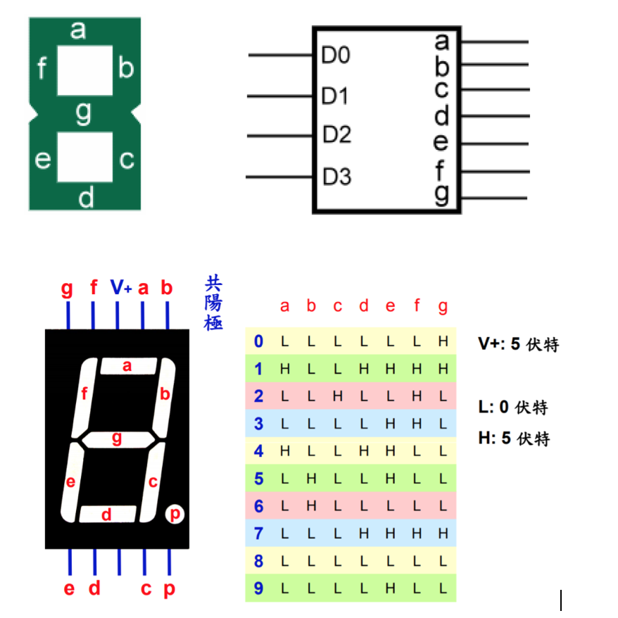

### Logic_Design
logic design in VHDL

Q1. Design a 2-to-4 decoder

Q2. Design a 4-to-1 Multiplexer

Q3. Design a 3-to-8 decoder

Q4. Design a simple ALU

Q5. Design a 2*2 multiplier

Q6. Design a half adder

Q7. Design a D-flip flop differentiator

Q8. Design Moore State Machine

Q9. Design a 7 segment display

Q10. Design a up-down counter
 
